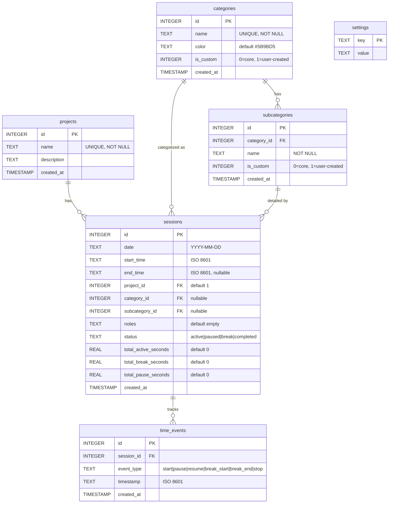

# DevTracker — Database Schema & Relationships

## Overview

DevTracker uses **SQLite** as its database, stored at `./data/tracker.db` (configurable via `DB_PATH`). Connection lifecycle is managed by the `db_session` context manager in `src/database.py`.

**Connection Settings:**
- **Timeout:** 20 seconds (to handle potential locks in concurrent environments).
- **Row Factory:** `sqlite3.Row` (enables dictionary-like access to columns).
- **WAL Mode:** `PRAGMA journal_mode=WAL` — Write-Ahead Logging for better concurrent performance.
- **Foreign Keys:** `PRAGMA foreign_keys=ON` — Enforced for referential integrity.

---

## Entity Relationship Diagram

---

## Tables

### `projects`
Stores high-level projects that sessions belong to.

| Column | Type | Constraints | Description |
|--------|------|-------------|-------------|
| `id` | INTEGER | PK, AUTOINCREMENT | Unique ID |
| `name` | TEXT | NOT NULL, UNIQUE | Project name |
| `description` | TEXT | | Project description |
| `created_at` | TIMESTAMP | DEFAULT CURRENT_TIMESTAMP | Creation date |

### `categories`
Stores both the 11 default software development categories and any user-created custom categories.

| Column | Type | Constraints | Description |
|--------|------|-------------|-------------|
| `id` | INTEGER | PK, AUTOINCREMENT | Unique ID |
| `name` | TEXT | NOT NULL, UNIQUE | Category name |
| `color` | TEXT | DEFAULT `#5B9BD5` | Hex color for UI display |
| `is_custom` | INTEGER | DEFAULT 0 | `0` = core, `1` = custom |
| `created_at` | TIMESTAMP | DEFAULT CURRENT_TIMESTAMP | Creation date |

### `subcategories`
Child activities belonging to a category. Each category can have multiple subcategories.

| Column | Type | Constraints | Description |
|--------|------|-------------|-------------|
| `id` | INTEGER | PK, AUTOINCREMENT | Unique ID |
| `category_id` | INTEGER | FK → categories(id), ON DELETE CASCADE | Parent category |
| `name` | TEXT | NOT NULL | Subcategory name |
| `is_custom` | INTEGER | DEFAULT 0 | `0` = core, `1` = custom |
| `created_at` | TIMESTAMP | DEFAULT CURRENT_TIMESTAMP | Creation date |

**Unique constraint:** `(category_id, name)` — no duplicate subcategory names within a category.

### `sessions`
Each tracked work session, either via the timer or manual entry.

| Column | Type | Constraints | Description |
|--------|------|-------------|-------------|
| `id` | INTEGER | PK, AUTOINCREMENT | Unique ID |
| `date` | TEXT | NOT NULL | Session date (YYYY-MM-DD) |
| `start_time` | TEXT | nullable | ISO 8601 start timestamp |
| `end_time` | TEXT | nullable | ISO 8601 end timestamp |
| `project_id` | INTEGER | FK → projects(id) | Parent project |
| `category_id` | INTEGER | FK → categories(id), nullable | Activity category (optional) |
| `subcategory_id` | INTEGER | FK → subcategories(id), nullable | Specific subcategory |
| `notes` | TEXT | DEFAULT `''` | Free-text notes |
| `status` | TEXT | CHECK IN (active, paused, break, completed) | Current state |
| `total_active_seconds` | REAL | DEFAULT 0 | Accumulated active work time |
| `total_break_seconds` | REAL | DEFAULT 0 | Accumulated break time |
| `total_pause_seconds` | REAL | DEFAULT 0 | Accumulated pause time |
| `created_at` | TIMESTAMP | DEFAULT CURRENT_TIMESTAMP | Creation date |

### `time_events`
Granular timeline of state changes within a session. Used by the timer engine for precise time calculation.

| Column | Type | Constraints | Description |
|--------|------|-------------|-------------|
| `id` | INTEGER | PK, AUTOINCREMENT | Unique ID |
| `session_id` | INTEGER | FK → sessions(id), ON DELETE CASCADE | Parent session |
| `event_type` | TEXT | CHECK IN (start, pause, resume, break_start, break_end, stop) | Event type |
| `timestamp` | TEXT | NOT NULL | ISO 8601 event timestamp |
| `created_at` | TIMESTAMP | DEFAULT CURRENT_TIMESTAMP | Creation date |

### `settings`
Simple key-value store for application settings.

**Known keys:**
- `daily_target_hours` — The user’s daily work target in hours (default: `9.0`)

| Column | Type | Constraints | Description |
|--------|------|-------------|-------------|
| `key` | TEXT | PK | Setting name |
| `value` | TEXT | NOT NULL | Setting value |

---

## Relationships Summary

| From | To | Type | Cascade |
|------|----|------|---------|
| `projects` → `sessions` | One-to-Many | ON DELETE RESTRICT |
| `categories` → `subcategories` | One-to-Many | ON DELETE CASCADE |
| `categories` → `sessions` | One-to-Many | — |
| `subcategories` → `sessions` | One-to-Many (optional) | — |
| `sessions` → `time_events` | One-to-Many | ON DELETE CASCADE |
